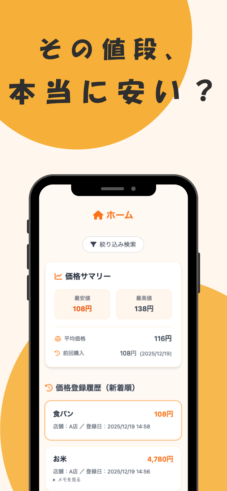
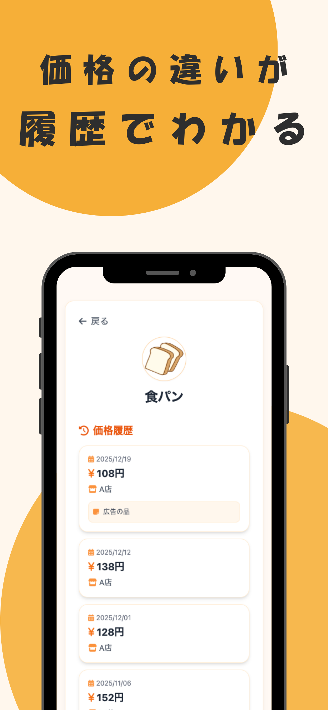
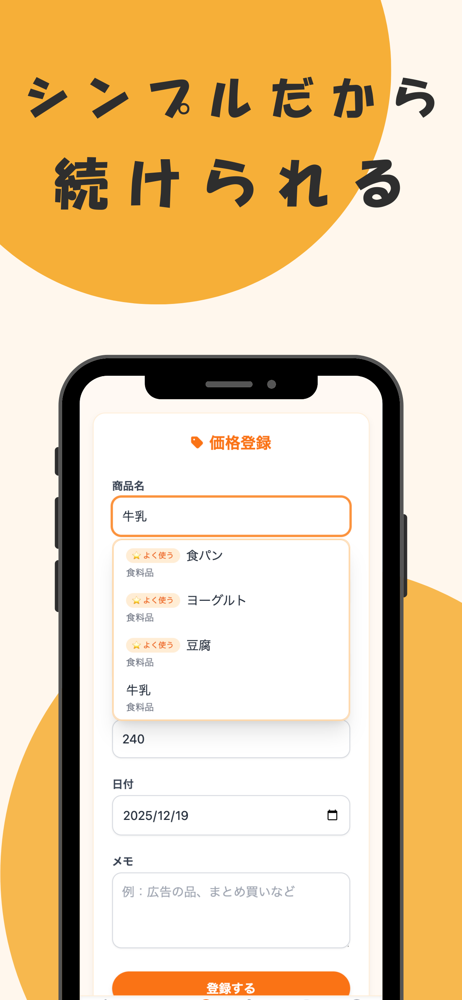
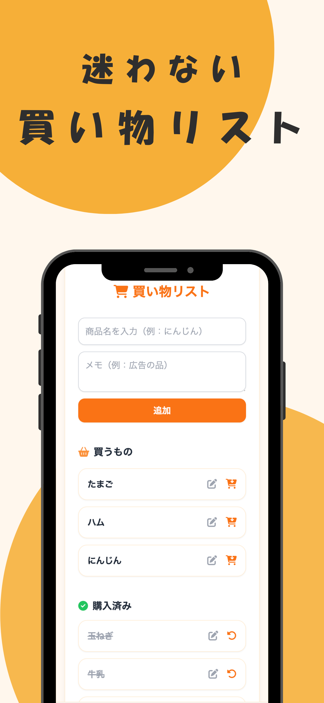
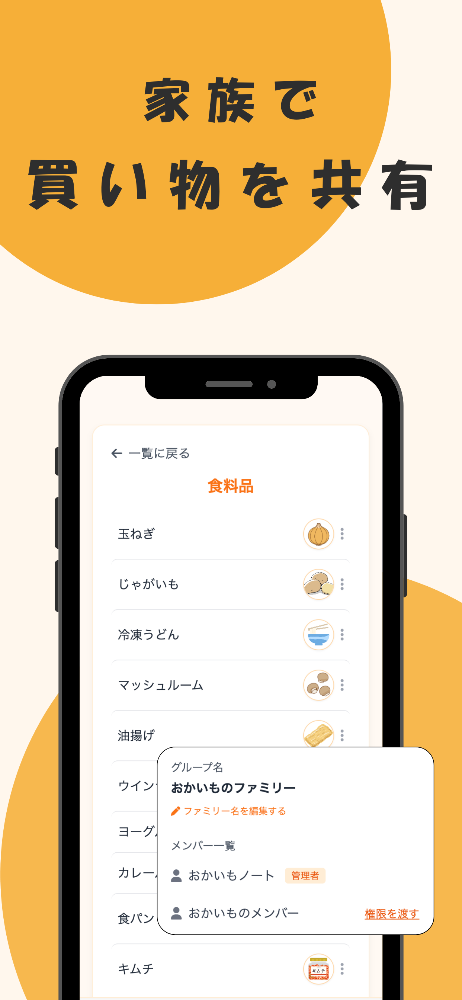
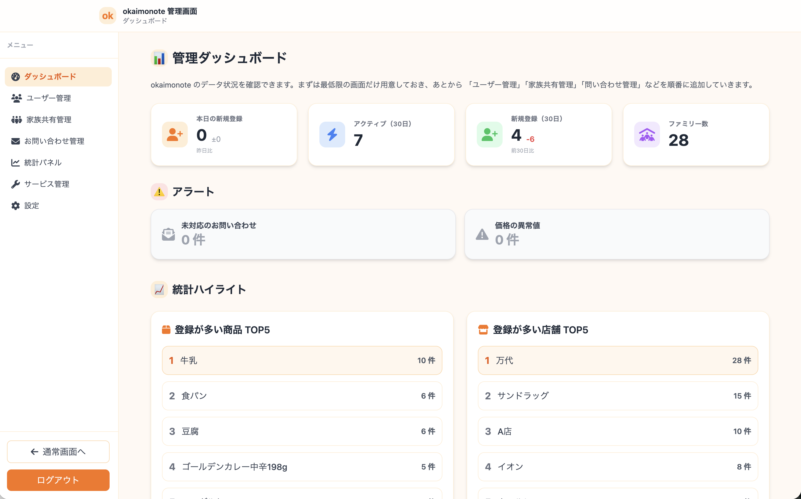

# 🛒おかいもノート (okaimonote)

## 📖サービス概要
「おかいもノート」は、日用品や食材の購入価格を記録し、
自分の過去データから「高い・安い」を判断できる節約サポートアプリです。

最安値・最高値・平均価格・直近の購入価格を一覧で確認でき、
買い物中に“本当にお得かどうか”を即座に判断できます。

## 📱 サービスイメージ
### 🏠 HOME｜価格サマリーで即判断

登録した商品の価格履歴から、
最安値・平均価格・直近価格を自動で表示します。

### 🛒 商品詳細｜価格履歴が資産になる

過去に購入した価格・日付・お店を履歴として一覧表示します。
「なんとなく安い」ではなく、**自分の実績データ**から価格差を判断できます。

### ✏️ 価格登録｜シンプルだから続けられる

商品名・価格・日付・メモを入力するだけのシンプルな価格登録画面です。
よく使う商品は候補に表示されるため、入力の手間を最小限に抑えています。

### 🛍 買い物リスト｜迷わず買える

買うもの・購入済みを分けて管理できる買い物リスト機能です。
買い忘れを防ぎつつ、購入後はワンタップで整理できます。

### 👨‍👩‍👧‍👦 家族共有｜価格感覚を家族で揃える

家族グループを作成し、商品・価格・買い物リストを共有できます。
「平均価格以下なら買ってきてほしい」など、
価格の基準を共有することで、家族間の認識ズレを減らせます。

### 👨‍💼 管理者画面｜運用を見据えた設計

管理者向けに、ユーザー・ファミリー・登録データの状況を
ひと目で把握できるダッシュボードを用意しています。

ユーザー管理・家族共有管理・お問い合わせ管理など、
サービス運用を想定した機能を段階的に拡張できる構成です。

## 💡開発の背景・想い
妊娠・育児中の妻の代わりに買い物に行く機会が増えたことがきっかけです。

スーパーでは「特価」「広告の品」といった表示が多く、
結局どれが本当に安いのか分からなくなることがありました。

自分の過去の購入価格が分かれば、ポップに惑わされず、
在庫状況や必要性に応じた冷静な判断ができると考え、
「おかいもノート」を作りました。

## 🎯ターゲットユーザー
- 節約意識の高い 主婦・主夫の方
- 一人暮らしで 日々の出費を抑えたい方
- 定期的に購入する日用品・食材を賢く管理したい方

数円〜数十円の差でも積み重ねを大切にしたい方を想定しています。

## ✨サービスの利用イメージ
お店で商品を見ながら、アプリに登録した価格と比べるだけで節約判断ができます。

経験値からなんとなくこの商品はいつもより安いだろうではなく、
明確に価格が分かるので、商品購入の判断材料の1つになると思います。

一見すると安そうな商品のポップでも、
自分の購入価格より高ければ、そのままスルー。

逆に、過去より安い価格に出会えたときは、
購入を検討してみてください。晩ご飯のメニューが変わるかもしれません。

## 👤ユーザーの獲得について
まずはSNSでのアプローチが有効だと思っています。

特定のターゲット層に届いて、優位性を感じてもらえれば、ママ友などの近隣コミュニティから口コミでも広がるのではないかと思っています。

## 🔍サービスの差別化ポイント・推しポイント
-類似アプリの特徴を比較しています。

おかいもノートは「自分や家族の実績データ」を重視しており、
全国一律の相場ではなく、生活圏に合った判断ができる点を特徴としています。

[機能比較]
| アプリ      |バーコード読み取り|家族シェア     |価格履歴　　　|買い物リスト|分析              |
| -----------|---------------|------------|------------|----------|---------------- |
|おかいもノート | ×            | ⭕️          | ⭕️          | ⭕️       | ⭕️ 　　　　　　　 |
|A           | ⭕️             | ×          | ⭕️          | ×        | △(自身の履歴のみ) |
|B	         | ⭕️             | ×          | △(安値のみ)  | ×        | ×               |
|C	         | ⭕️             | ×          | △(安値のみ)  | ×        | ×               |
|D           | ⭕️             | ×          | △(安値のみ)  | ⭕️        | ⭕️             |
|E           | ×              | △(2人のみ)  | △(安値のみ)  | ⭕️        | ×              |

## 画面遷移図
https://www.figma.com/design/JjdRUEWuNYMQrnJhOCZyXz/%E3%81%8A%E3%81%8B%E3%81%84%E3%82%82%E3%83%8E%E3%83%BC%E3%83%88?node-id=0-1&p=f&m=draw

## 🌐主な機能
### 実装済み
- ユーザー登録・ログイン (Devise)
- 商品登録 (名前,価格,日付,メモ)
- 商品一覧,カテゴリー,お店管理
- 価格サマリー(最安値,最高値,平均,直近購入)の表示
- 検索・絞り込み (ransack)
- お買い物リスト
- 家族共有 (買い物を頼む際に「平均価格以下であれば買ってほしい」などと共有可能)
- 商品画像登録(S3)
- LINE, Googleログイン

### 今後追加予定
- 全国ユーザー統計 (エリア別価格比較)
- iOSアプリ化
- 課金利用制度

## 👨‍💼 管理者機能（Admin）

- ユーザー管理（権限・ステータス）
- 商品・カテゴリ・お店の管理
- データ集計・統計表示
- 運用・スケールを意識した設計

## 🛠機能の実装方針予定
| カテゴリ         | 技術構成                  |
|----------------|-------------------------|
| フロントエンド   |Tailwind/Turbo/Stimulus |
| バックエンド     |Ruby on Rails            |
| 認証            |Devise                   |
| DB             |PostgreSQL (Neon)        |
| 非同期UI        |Turbo Stream/Stimulus    |
| 商品検索        |ransack                  |
| インフラ        |Render + Neon + AWS(S3)　|
| コンテナ        |Docker                   |

### 🚀 デモ環境

https://okaimonote.com

**デモユーザー①**
メール: demo1@example.com
パスワード: okaimonote1

**デモユーザー②**
メール: demo2@example.com
パスワード: okaimonote2
